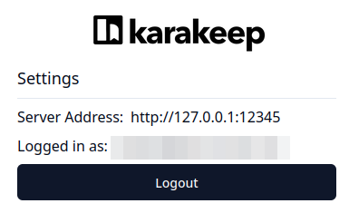

<p align="center">
  
</p>
<p align="center">
  </br>
  <b>prxy</b> is a command-line reverse proxy written in <a href="https://go.dev/">Go</a> for forwarding HTTP requests through an outbound proxy, while automatically rewriting the <b>Host</b> header for you.
</p>
<hr>

[](https://github.com/Madh93/prxy/releases)
[](https://go.dev/doc/install)
[](https://goreportcard.com/report/github.com/Madh93/prxy)
[](https://github.com/Madh93/prxy/actions)
[](https://pkg.go.dev/github.com/Madh93/prxy)
[](LICENSE)

<p align="center">
  <a href="#why">Why?</a> •
  <a href="#installation">Installation</a> •
  <a href="#usage">Usage</a> •
  <a href="#contributing">Contributing</a> •
  <a href="#acknowledgements">Acknowledgements</a> •
  <a href="#license">License</a>
</p>

## Why?

The idea for `prxy` was born out of a common, yet specific, personal need: accessing self-hosted services in my homelab from the other side of the world.

Like many [homelab](https://www.reddit.com/r/homelab/) enthusiasts, my services are not exposed to the public internet; they are only accessible through a [WireGuard VPN](https://www.wireguard.com/). While connecting to the VPN is easy, I didn't want to route my entire computer's traffic through my home network. This would change my public IP and slow down my local internet access.

The goal was to achieve split-tunneling on an application-by-application basis. A fantastic tool, [wireproxy](https://github.com/whyvl/wireproxy), got me 90% of the way there. It creates an HTTP proxy from a WireGuard peer, allowing applications with proxy settings (like [Firefox Containers](https://support.mozilla.org/en-US/kb/containers), [Thunderbird](https://www.thunderbird.net/), or [Joplin](https://joplinapp.org/)) to have their traffic transparently routed through the VPN.

**But what about applications that don't support proxy configurations?**

This was the missing piece. Many tools, especially browser extensions or simple clients, expect a direct URL and have no field to enter a proxy. This is precisely the gap `prxy` is designed to fill.

`prxy` acts as the perfect companion to `wireproxy`. It creates a local HTTP reverse proxy that can forward traffic to your target service *through* another outbound proxy (like the one `wireproxy` creates). Crucially, it automatically rewrites the `Host` header, ensuring the request reaches your service correctly, even if it's behind a reverse proxy in your homelab.

### A Real-World Example

I selfhost [Karakeep](https://karakeep.app/). The [Browser extensions](https://docs.karakeep.app/quick-sharing/#browser-extensions) need a URL to connect to, but don't have a proxy setting. With `prxy`, the solution is simple:

```shell
prxy --target https://karakeep.my-homelab.tld \
     --proxy http://127.0.0.1:25345 \
     --port 12345
```

Now, I can configure the Karakeep extension to point to `http://localhost:12345`. `prxy` accepts the connection locally and transparently forwards it through `wireproxy` to my homelab, making the extension work seamlessly as if I were on my local network.

<div align="center">
  
</div>

## Installation

### GNU/Linux or macOS

Via [Homebrew](https://brew.sh/):

```shell
brew install madh93/tap/prxy
```

### Docker

#### Using `docker run`

Use the `docker run` command to start `prxy`:

```sh
docker run --name prxy ghcr.io/madh93/prxy:latest --target https://myservice.domain.tld \
     --proxy http://my-http-proxy \
     --port 12345
```

#### Using `docker compose`

Create a `docker-compose.yml` file with the following content:

```yml
services:
  prxy:
    image: ghcr.io/madh93/prxy:latest
    restart: unless-stopped
    environment:
      - PRXY_TARGET=https://myservice.domain.tld
      - PRXY_PROXY=http://my-http-proxy
      - PRXY_PORT=12345
```

Use the `docker compose up` command to start `prxy`:

```sh
docker compose up
```

### From releases

Download the latest binary from [the releases page](https://github.com/Madh93/prxy/releases):

```sh
curl -L https://github.com/Madh93/prxy/releases/latest/download/prxy_$(uname -s)_$(uname -m).tar.gz | tar -xz -O prxy > /usr/local/bin/prxy
chmod +x /usr/local/bin/prxy
```

### From source

If you have Go installed:

```sh
go install github.com/Madh93/prxy@latest
```

## Usage

To start `prxy`, you need to specify at least the target and outbound proxy URLs.

```shell
prxy --target https://myservice.domain.tld --proxy http://127.0.0.1:25345 --port 12345
```

Now, requests to `http://127.0.0.1:12345/some/path` will be forwarded to `https://myservice.domain.tld/some/path` with the `Host: myservice.domain.tld` header, through your outbound proxy.

### Configuration Options

The application can be configured using command-line flags or environment variables.

For a complete and up-to-date list of all available flags, you can always run:

```shell
prxy --help
```

The main configuration options are summarized in the table below:

| Flag | Environment Variable | Description | Required | Default Value |
| :--- | :--- | :--- | :--- | :--- |
| `--target`, `-t` | `PRXY_TARGET` | Target service URL. | **Yes** | N/A |
| `--proxy`, `-x` | `PRXY_PROXY` | Outbound HTTP Proxy URL. | **Yes** | N/A |
| `--host`, `-H` | `PRXY_HOST` | Host to listen on. | No | `localhost` |
| `--port`, `-P` | `PRXY_PORT` | Port to listen on. | No | `random` |
| `--log-level`, `-l` | `PRXY_LOG_LEVEL` | Set log level: `debug`, `info`, `warn`, `error`, `fatal`. | No | `info` |
| `--log-format`, `-f` | `PRXY_LOG_FORMAT`| Set log format: `text`, `json`. | No | `text` |
| `--log-output`, `-o`| `PRXY_LOG_OUTPUT`| Set log output: `stdout`, `stderr`, `file`. | No | `stdout` |

### Configuration Precedence

As an alternative to flags, all configuration options can be set using environment variables prefixed with `PRXY_`.

It is important to understand the configuration precedence order:

1. **Command-line flags** (Highest priority)
2. **Environment variables**
3. **Default values** (Lowest priority)

This means a flag will always override the value of an environment variable if both are defined. Environment variables are ideal for establishing a base configuration, especially in containerized environments or CI/CD pipelines, while flags are useful for overriding that configuration for a specific execution.

## Contributing

Contributions are welcome! Please open an issue or submit a pull request for any bug fixes or enhancements.

1. Fork the repository.
2. Create a new branch (`git checkout -b feature-branch`).
3. Commit your changes (`git commit -am 'Add new feature'`).
4. Push to the branch (`git push origin feature-branch`).
5. Open a Pull Request.

## Acknowledgements

* The `prxy` logo was adapted from the amazing [free-gophers-pack](https://github.com/MariaLetta/free-gophers-pack) created by [Maria Letta](https://github.com/MariaLetta).

## License

This project is licensed under the [MIT license](LICENSE).
